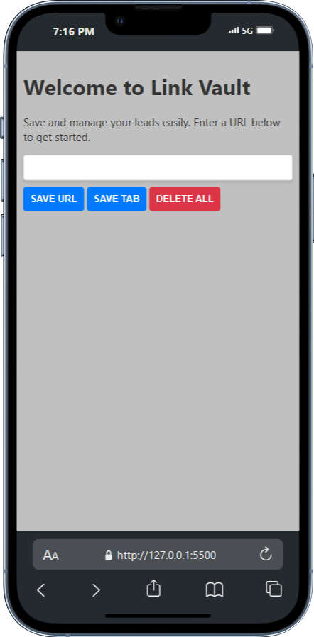

# **Link Vault**

## **Table of Contents**

- [Project Overview](#project-overview)
- [Features](#features)
- [Installation](#installation)
- [Usage](#usage)
- [Technologies Used](#technologies-used)
- [Screenshots](#screenshots)
- [License](#license)

## **Project Overview**

Link Vault is a Chrome extension that allows users to save, manage, and delete URLs. It provides a user-friendly interface to keep track of important links efficiently.

## **Features**

- Save URLs by entering them manually.
- Save the current browser tab's URL with a single click.
- Delete all saved URLs with a double-click.
- Delete individual URLs from the list.
- Responsive design optimized for mobile and desktop devices.

## **Installation**

- Clone the repository.
- Navigate to the project directory: `cd Link Vault`
- Open Chrome and go to `chrome://extensions/`.
- Enable "Developer mode" in the top right corner.
- Click "Load unpacked" and select the project directory.

## **Usage**

Once the extension is installed, you can use the Link Vault extension to manage your URLs.

- Click the Link Vault icon in the Chrome toolbar to open the extension.
- Enter a URL in the input field and click the "SAVE URL" button to save it.
- Click the "SAVE TAB" button to save the current browser tab's URL.
- Double-click the "DELETE ALL" button to delete all saved URLs.
- Click the "X" button next to each URL in the list to delete individual URLs.

## **Technologies Used**

-  - Used for structuring the web page.
-  - Used for styling components.
-  - Used for interactivity and logic implementation.

## **Screenshots**

|  |  |
| :---------------------------------------------------------------: | :----------------------------------------------------------: |
|                       Link Vault on Desktop                       |                     Link Vault on Mobile                     |

## **License**

This project is licensed under the MIT License - see the [LICENSE](LICENSE) file for details.

<!-- IVIonsters Designs -->
